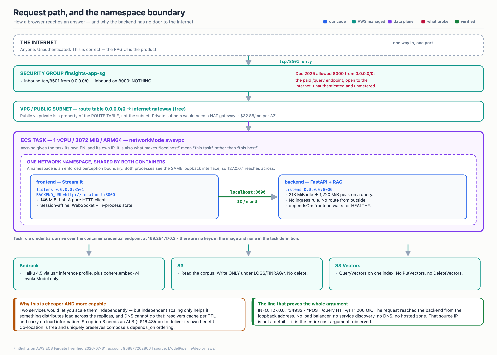

# FinSights

#### Course Project (MLOps IE7374) — FinSights.

A production-grade financial document intelligence system. FinSights turns SEC 10-K filings into an
answerable corpus, then answers analyst questions against it with citations back to the exact filing sentences.

- **The problem.** Analysts spend hours parsing dense 10-K filings to pull KPIs and answer strategic
  questions. Manual reading does not scale across companies, years, and sections.
- **The approach.** Two supply lines feed one answer: *structured* KPI extraction from parsed financial
  tables, and *semantic* retrieval over sentence-level embeddings. An LLM synthesises them into a grounded
  response that cites real `sentenceID`s — not a summary of a summary.
- **The scope, stated honestly.** 25 companies, 614,647 embedded sentences (1024-d, 2006–2025). The upstream
  ETL universe is much larger; the embedded corpus is what the system can actually answer about.

### Quick Redirect (Setup)

- **[Setup Instructions](ModelPipeline/README.md#L38)** — start here.
- Two setup paths. Preferred: **[Docker, local (RECOMMENDED)](ModelPipeline/finrag_docker_loc_tg1/LOC_DOCKER_README.md)**.
  Alternative: [command/PS1 launcher scripts](ModelPipeline/SETUP_README.md).
- **Cloud deployment (current).** One command brings the whole stack up on AWS ECS Fargate and one takes it
  back to zero: **[ECS Fargate Runbook](ModelPipeline/finrag_docker_loc_tg1_aws/ECS_FARGATE_RUNBOOK.md)**.
- **Cloud deployment (historical).** The Dec 2025 public deployment ran on an account since decommissioned.
  Preserved as a record, **not** a runbook:
  [ECS record](ModelPipeline/finrag_docker_loc_tg1_aws/HISTORICAL_2025-12_ECS_DEPLOYMENT_GUIDE.md) ·
  [infrastructure record](HISTORICAL_2025-12_INFRASTRUCTURE_SETUP_GUIDE.md).

### Full Model Readme at:

- [ModelPipeline README](ModelPipeline/README.md). Every document is indexed in the
  [Documentation Index](ModelPipeline/finrag_ml_tg1/DOCUMENTATION_INDEX.md).

## Architecture Diagram:

<p align="center">
  
</p>
<p align="center"><em>FinSights Architecture Diagram</em></p>

---

## Service Architecture

Three-tier SOA — presentation, application, business logic — collapsed into **one** ECS Fargate task so the
tier boundary is a function call and a loopback socket rather than a network hop you pay for.

```
                                    ┌───────────────┐
                                    │    BROWSER    │   anyone, unauthenticated
                                    └───────┬───────┘   (the RAG UI is the product)
                                            │ tcp/8501 — the only door in
════════════════════════════════════════════▼══════════════════════════════════════
  ECS FARGATE TASK · ARM64 ·  1 vCPU / 3072 MiB  ·  awsvpc: ONE network namespace
───────────────────────────────────────────────────────────────────────────────────
  ┌───────────────────────────────┐                  ┌───────────────────────────┐
  │ PRESENTATION — Streamlit      │  localhost:8000  │ APPLICATION — FastAPI     │
  │ :8501  session state, UI comps│ ───────────────► │ :8000  NO ingress rule    │
  │ pure HTTP client, no ML code  │  $0 · no ALB     │ Pydantic request/response │
  │ 146 MiB, flat                 │  no DNS, no hop  │ 213 MiB idle → 1,220 peak │
  └───────────────────────────────┘                  └─────────────┬─────────────┘
                                                                   │ Python call,
                                                                   │ same process
  ┌────────────────────────────────────────────────────────────────▼─────────────┐
  │ BUSINESS LOGIC — RAGOrchestrator.answer_query()                              │
  │                                                                              │
  │   EntityAdapter.extract()  →  companies · years · metrics · sections · risk  │
  │        ├── SUPPLY LINE 1   MetricPipeline      → structured KPI block        │
  │        └── SUPPLY LINE 2   QueryEmbedderV2     → 1024-d query vector         │
  │                                                                              │
  │   triple retrieval   filtered ∪ global ∪ variants  →  dedupe on sentenceID   │
  │        →  ±3-sentence window expansion, edge-safe                            │
  │        →  citation-headed context assembly (company | FY | doc | section)    │
  │        →  LLM synthesis  →  cited answer + one row in the cost ledger        │
  └────────────────────────────────────────────────────────────────┬─────────────┘
════════════════════════════════════════════════════════════════════▼══════════════
  IAM task role, delivered over the container credential endpoint 169.254.170.2
  — no access keys in the image, none in the task definition, none in the repo.

  ┌─────────────────────┐  ┌──────────────────────┐  ┌──────────────────────────┐
  │ Bedrock             │  │ S3 Vectors           │  │ S3                       │
  │ Claude Haiku 4.5    │  │ 614,647 × 1024-d     │  │ corpus parquet (read)    │
  │ Cohere Embed v4     │  │ metadata pushdown    │  │ query logs (write, and   │
  │ InvokeModel only    │  │ QueryVectors only    │  │ only under LOGS/FINRAG/) │
  └─────────────────────┘  └──────────────────────┘  └──────────────────────────┘
```

<p align="center">
  
</p>
<p align="center"><em>The request path, and why the backend has no door to the internet.
Full diagram set and the reasoning behind each choice:
<a href="ModelPipeline/finrag_docker_loc_tg1_aws/SYSTEMS_WALKTHROUGH.md">Systems Walkthrough</a>.</em></p>

---

## Project Overview

Read top to bottom for the arc, or jump straight to a link.

**Design and data engineering**

1. Business framing, cost estimates, tool research and algorithm analysis live in
   [Scoping](design_docs/Project_Scoping_IE7374_FinSights.pdf) and [HLD](design_docs/Finance_RAG_HLD_v1.xlsx) (Excel).
   The Excel sheet is the most useful single reference for a new developer.
2. `DataPipeline/src` + `DataPipeline/dag` run live SEC EDGAR ingestion — crawl, download, parse, upload
   structured filings to S3, orchestrated by Airflow. See [DataPipeline README](DataPipeline/README.md).
3. `DataPipeline/src_aws_etl/` is where bulk historical data and incremental live data merge, with archival
   and log management. `DataPipeline/src_metrics/` extracts the raw financial numbers from each filing.
4. `DataPipeline/data_auto_stats/` handles schema validation, data-quality gates, anomaly detection and
   alerting via Great Expectations.
5. Exploratory work is preserved, not discarded:
   [DuckDB analytics](DataPipeline/data_engineering_research/duckdb_data_engineering/Data_Engineering_README.md),
   [Polars EDA + research](DataPipeline/data_engineering_research/exploratory_research/Research_README.md),
   and the [Master EDA Notes](DataPipeline/data_engineering_research/exploratory_research/polars_eda_research/Master_EDA_Notes.pdf).
   The authoritative view of what is in the cloud is [CLOUD_SOURCE_OF_TRUTH](DataPipeline/CLOUD_SOURCE_OF_TRUTH.md).

**Embedding and index**

6. `ModelPipeline/finrag_ml_tg1/platform_core/` builds Stage 2 (sentence + embedding metadata) and Stage 3
   (the S3 Vectors index): token-aware batching, outlier pre-filtering, embedding lineage per row.
7. Feature-engineering rationale — why sentence grain, why these metadata fields — is in
   [ML_FEAT_ENG_DESIGN](ModelPipeline/finrag_ml_tg1/ML_FEAT_ENG_DESIGN.md).
8. Vectors live in **S3 Vectors**, not a managed vector DB. Parquet as cold storage, S3 Vectors as the hot
   query layer, ~99% cheaper than a managed baseline: [S3Vect_QueryCost](ModelPipeline/finrag_ml_tg1/S3Vect_QueryCost.md).

**Retrieval and synthesis**

9. `rag_modules_src/entity_adapter/` is the semantic front end: company aliases and tickers → CIK, multi-year
   and range parsing, metric mapping, section and risk-topic detection, all with fuzzy fallbacks.
10. Two supply lines run per query — structured KPI lookup and 1024-d semantic retrieval — then merge. Triple
    retrieval (filtered / global / LLM-generated variants) is deduplicated on `sentenceID`.
11. `rag_modules_src/synthesis_pipeline/orchestrator.py` exposes the whole thing as one `answer_query()` call.
    YAML prompt templates keep prompts out of code. Every answer carries citations and a cost row.
12. Full technical chronology, Parts 1–13, including every evaluation and refactor:
    **[IMPLEMENTATION_GUIDE](ModelPipeline/finrag_ml_tg1/IMPLEMENTATION_GUIDE.md)**.

**Serving and deployment**

13. `ModelPipeline/serving/` separates presentation, application and business logic cleanly — the frontend
    holds no ML code, the backend holds no display logic: [SERVING_DESIGN](ModelPipeline/serving/SERVING_DESIGN.md).
14. Local Docker and cloud Fargate share the same two images. Local still talks to real S3 and real Bedrock,
    so behaviour does not diverge between environments.
15. `ModelPipeline/deploy_aws/` is the infrastructure control plane written as ordinary Python: a frozen
    config object, cached boto3 clients, least-privilege IAM built from code, and `up` / `down` / `destroy`
    verbs. Destroy-and-rebuild is the integration test — [DEPLOY_LEDGER](ModelPipeline/deploy_aws/DEPLOY_LEDGER.md).
16. Deployment is **manual by design**. `.github/workflows/aws-deploy-manual.yml` triggers only on
    `workflow_dispatch` — a button in the Actions tab, never an automatic push-to-prod.
17. Double-click launchers for people who do not want a terminal: `ModelPipeline/finsights.command` (local)
    and `ModelPipeline/finsights_aws.command` (cloud).

**Cost, latency and evidence**

18. Cost is ~$0.014–$0.06+ per query, scaling with complexity. Idle infrastructure cost at `down` is ~$0.06/month
    (ECR storage only) because nothing is left running.
19. Latency is **9.6–14s** for simple and moderate queries, **50s+** for multi-year and cross-company
    comparisons, and has reached ~4 minutes on very large KPI-heavy questions. The pipeline itself is a near-constant
    5–8s; the rest is LLM generation time: [PIPELINE_LATENCY_ANALYSIS](ModelPipeline/finrag_ml_tg1/PIPELINE_LATENCY_ANALYSIS.md).
20. Claims here are backed by measurement, not assertion. Constructor timing, `tracemalloc` traces, container
    memory under load, cross-provider embedding determinism, token-level cost accounting, and the studies that
    **failed**, are all recorded in
    **[EMPIRICAL_METHODS_AND_FINDINGS](ModelPipeline/finrag_ml_tg1/investigation_analysis/EMPIRICAL_METHODS_AND_FINDINGS.md)**
    and [TECHNIQUES_THAT_UNDERPERFORMED_HERE](ModelPipeline/finrag_ml_tg1/investigation_analysis/TECHNIQUES_THAT_UNDERPERFORMED_HERE.md).
21. Memory discipline is a design constraint, not an afterthought: lazy Polars scans, deliberate eager reads
    where they are correct, and a documented history of kernel crashes that shaped it —
    [TechNotes_MemoryExp_Handling](ModelPipeline/finrag_ml_tg1/TechNotes_MemoryExp_Handling.md).
22. MLOps requirement mapping and environment rationale:
    [LLMOPS_TECHNICAL_COMPLIANCE](ModelPipeline/finrag_ml_tg1/LLMOPS_TECHNICAL_COMPLIANCE.md).

## Project Structure:

```
📦 FinSights/
 ┣ 📂 DataPipeline/                       # SEC ingestion, ETL, data quality
 ┃ ┣ 📂 dag/                              # Airflow DAGs
 ┃ ┣ 📂 src/  📂 src_edgar_incremental/    # EDGAR SDK ingestion, incremental crawl
 ┃ ┣ 📂 src_metrics/                      # Financial KPI extraction from filings
 ┃ ┣ 📂 src_aws_etl/                      # S3 merge (historical + incremental), archival, logs
 ┃ ┣ 📂 data_auto_stats/                  # Great Expectations, anomaly detection, alerts
 ┃ ┣ 📂 data_engineering_research/        # DuckDB analytics, Polars EDA, SQL exploration
 ┃ ┗ 📜 CLOUD_SOURCE_OF_TRUTH.md          # What actually exists in S3
 ┃
 ┣ 📂 ModelPipeline/                      # ALL active ML and serving work
 ┃ ┣ 📂 finrag_ml_tg1/                    # The Python ML package
 ┃ ┃ ┣ 📂 platform_core/                  # Stage 2 embeddings, S3 Vectors provisioning + ingestion
 ┃ ┃ ┣ 📂 rag_modules_src/                # Query-time RAG components
 ┃ ┃ ┃ ┣ 📂 entity_adapter/               # NL → companies, years, metrics, sections, risk topics
 ┃ ┃ ┃ ┣ 📂 metric_pipeline/              # Supply line 1: structured KPI lookup
 ┃ ┃ ┃ ┣ 📂 rag_pipeline/                 # Supply line 2: retrieval, expansion, context assembly
 ┃ ┃ ┃ ┣ 📂 synthesis_pipeline/           # orchestrator.py, LLM synthesis, citation validation
 ┃ ┃ ┃ ┣ 📂 prompts/                      # YAML prompt templates
 ┃ ┃ ┃ ┗ 📂 utilities/ 📂 constants/       # Logging, errors, shared helpers
 ┃ ┃ ┣ 📂 loaders/                        # MLConfig service, DataLoader strategies
 ┃ ┃ ┣ 📂 investigation_analysis/         # Measurement scripts + findings (the evidence base)
 ┃ ┃ ┣ 📂 validation_notebooks/ 📂 tests/  # Gold test suites, unit + integration tests
 ┃ ┃ ┣ 📂 .aws_config/                    # ml_config.yaml — 200+ model/retrieval parameters
 ┃ ┃ ┗ 📂 .aws_secrets/                   # Credentials (gitignored, never read by tooling)
 ┃ ┃
 ┃ ┣ 📂 serving/                          # backend/ FastAPI :8000  ·  frontend/ Streamlit :8501
 ┃ ┣ 📂 deploy_aws/                       # AWS control plane as Python
 ┃ ┃ ┣ 📜 config.py  📜 aws_session.py     # Frozen config object, cached boto3 clients
 ┃ ┃ ┣ 📜 policies.py  📜 taskdef.py       # Least-privilege IAM, ECS task definition builder
 ┃ ┃ ┣ 📜 provisioner.py  📜 images.py     # Idempotent provisioning, ECR build + push
 ┃ ┃ ┗ 📜 service.py  📜 cli.py            # Service lifecycle, up/down/status/smoke/destroy
 ┃ ┣ 📂 finrag_docker_loc_tg1/            # Local Docker build context
 ┃ ┣ 📂 finrag_docker_loc_tg1_aws/        # Cloud build context, runbook, diagrams/, study_notes/
 ┃ ┣ 📜 finsights.command                 # Double-click launcher — local
 ┃ ┗ 📜 finsights_aws.command             # Double-click launcher — AWS
 ┃
 ┣ 📂 Edgar-Sentences-SDK/                # HuggingFace dataset SDK (complete, read-only)
 ┣ 📂 design_docs/                        # Scoping PDF, HLD workbook, flow assets
 ┣ 📂 graphify-out/                       # Queryable knowledge graph of the repo
 ┣ 📂 .github/workflows/                  # CI + the manual aws-deploy-manual.yml button
 ┗ 📜 README.md                           # You are here
```

### Source Dataset Links:

1. Primary: https://huggingface.co/datasets/khaihernlow/financial-reports-sec
2. Primary dataset citation: https://zenodo.org/records/5589195
3. Live ingestion metrics: https://www.sec.gov/search-filings/edgar-application-programming-interfaces
4. SEC EDGAR API (`company_tickers.json`); State Street SPDR ETF holdings for S&P 500 constituents
5. Potentially used: EdgarTools — https://github.com/dgunning/edgartools
</content>
