<!--
DECK STATUS: built and pushed. `slidev build` clean, all diagram SVGs
validated as strict XML and confirmed serving. Every number below is cited to a source file in
its own slide's presenter notes. Two numbers (\$32.85/mo NAT, \$0.017-0.06
Bedrock cost band) are the only ones NOT independently re-measured this
session -- both are reported from the design-principles note / SYSTEMS_WALKTHROUGH.md, both
already carry [V] or an explicit AWS Pricing API citation in their own
source doc, and both are flagged as such in their slide's notes rather
than presented as fresh measurement.
-->

# FinSights
## SEC 10-K document intelligence with hybrid retrieval

Sep 2025 – Dec 2025

25 companies &middot; 2006-2025 &middot; **614,647** live vectors &middot; built for **$2.21**

<!--
Title slide, exempt from the one-number rule by convention (frame, not
argument). Verified against IMPLEMENTATION_GUIDE.md:43 (1,850 vectors/min,
\$2.21 total across three
bins) and the live S3 Vectors index count. Corpus is 25 companies, not the
upstream 4,674-company ETL universe -- that distinction matters and gets
its own correction elsewhere in the repo; not relitigated here.
-->

---
layout: two-cols
class: text-left compact-list
---

# Two supply lines feed one answer

SEC 10-K filings, 2006–2025 · 25 companies

$0.150/month to keep the whole 614,647-vector index live

- SEC 10-K sentence corpus, extending a 71M-sentence base — kept current via EDGAR SDK incremental ingestion and the SEC EDGAR API
- Structured financial KPIs from a third-party parsed-financials corpus, standing alongside the sentence text
- **Hybrid pipeline:** vector embeddings and entity adapters converge into a single, fully-provenanced context spanning financials, sentences, and analysis

::right::

<!--
REWRITTEN 2026-09-11 per Joel's direct correction after reviewing the live
deck: "the deck is the early-growth and impact presentability of the
project's initiatives... not your agentic-work memories." This slide
previously led with a \$17/month budget constraint and a "decision / hurt
quality" matrix -- a process/cost-discipline framing, not a proposition
about what the system is and does. Joel, verbatim: "under 17\$ that thing is
NOT a thing for us, dont use under 17/month tag. our tag is different."

New framing is the project's own stated thesis, verbatim from README.md:10
-- "Two supply lines feed one answer: structured KPI extraction from parsed
financial tables, and semantic retrieval over sentence-level embeddings."
Left-column bullets are Joel's own five framing points (SEC 10-K utility,
the 71M-sentence cold dataset, the live EDGAR SDK incremental feed, the
third-party tabular-metrics corpus, the hybrid-pipeline philosophy)
condensed to three for the face; nothing is fabricated, everything traces
to material already documented in this repo, not just this slide's own
prior draft.

REFINED 2026-09-11 after Joel reviewed this slide directly: two changes.
(1) Named the actual tooling behind "kept current" rather than leaving it
as a vague "live feed" -- EDGAR SDK incremental ingestion and the SEC
EDGAR API, both confirmed in README.md's own repo map and source-links
section (src_edgar_incremental, company_tickers.json). Did not name
"EdgarTools" specifically -- README.md:223 marks that one as "potentially
used," not confirmed, so it stays out of a slide face. (2) The
"hybrid pipeline" bullet was Joel's own rough phrasing, given as a bare
idea to refine, not to ship verbatim -- rewritten from a flat list
("embeddings + entity adapters assemble one context -- financials,
sentences, analysis, provenance") to a single sentence that states the
mechanism and the outcome ("vector embeddings and entity adapters converge
into a single, fully-provenanced context spanning financials, sentences,
and analysis"). Same theme and same four components, folding "provenance"
into an adjective rather than a fourth list item, since a fully-provenanced
context is what the pipeline actually claims to deliver.

STAT CORRECTION, not taken on request: the peer's spec asked for "average
cost per query, ~\$0.00004" and "total cost of the vector embeddings" as the
headline. Neither figure checked out as requested. \$0.00004 does not appear
anywhere in ModelPipeline/finrag_ml_tg1/S3Vect_QueryCost.md or any other
source I could find. The document's one figure literally labeled "Average
cost per query" is \$0.0170 (S3Vect_QueryCost.md:259) -- but that entire
table (lines 190-266) is a COST MODEL built from assumed monthly query
volumes (100/300/500/1,000/1,500/2,000/5,000 queries/month) and an assumed
35%/65% Sonnet/Haiku split, not a measurement of real traffic. This deck's
whole discipline has been measured over modeled, disclosed where it isn't,
so I did not put an unverified number or an unlabelled model estimate on
the opening slide's headline stat. Used \$0.150/month instead: real,
measured, already independently verified earlier in this project
(S3Vect_QueryCost.md's "Verified pricing -- measured 2026-08-05" section;
also matches the \$0.1452/30-day idle-floor figure in the same section,
small variance from rounding/estimation basis, not a contradiction). This
is a different number from the title slide's \$2.21 (that is the one-time
embedding-generation cost; this is the ongoing monthly storage cost) --
deliberately complementary, not redundant.
DIAGRAM NOTE: new diagram, hybrid-pipeline-thesis.svg. Two source boxes
(structured KPI extraction, semantic retrieval) converging via orthogonal
elbows into one focal "One answer" box, matching README.md's own two-lines-
into-one framing exactly. Not the decision-matrix diagram that lived here
before -- that content is being reframed separately as an "architecture
choices, each against a named alternative" slide per the orchestrator's
next spec, not yet built.
-->

---
layout: two-cols
class: text-left compact-list
---

# Corpus construction — selection, stratification and scoring

47sto stratify-sample 71M sentences into the working corpus

- In-process DuckDB and Polars over a hosted warehouse, stratifying three merged sources — S&P 500 holdings, SEC CIK mappings, and a 71M-sentence corpus
- Company selection is scored, not hand-picked — a weighted quality formula with five hard admission gates decides who enters the dataset
- Temporal and section imbalances are left uncorrected, deliberately — real disclosure variation is signal, not noise to normalize away

::right::

<!--
NEW SLIDE 2026-09-11, split out of the old "Corpus and checkpointed
regeneration" slide per the orchestrator's disposition table -- that slide
was doing two jobs (corpus selection AND embedding regeneration) and this
one takes the selection half, expanded with real material that was never
on a slide before.

Source: DataPipeline/data_engineering_research/duckdb_data_engineering/
DuckDB_Sampling_Strategy.md for the quality_score formula and the five
admission gates, verbatim, and its own line "These filters determine WHO
is in the dataset, not WHAT gets sampled" (quoted on the diagram exactly).
Inputs verified in the same doc: S&P 500 holdings via State Street SPDR
SPY daily holdings (503 holdings, 99.94% weight coverage), SEC EDGAR
company tickers (10,142 CIK-to-ticker mappings), plus a custom shortlist
for sector diversity and underrepresented industries.

The "47s" stat and "three merged sources" bullet are both from
Data_Engineering_README.md's "Production-Ready Proof" table (three
heterogeneous sources -- Excel SPY holdings, SEC JSON mappings, 71.8M-row
Parquet corpus -- merged via fuzzy matching; total pipeline wall-clock
~47s for corpus load through export, dominated by a 36.83s schema-
retrieval join, which the table itself calls "Expected (big join)" rather
than a problem). Rounded 71.8M to 71M to match the wording already
shipped on slide 1's bullet, not a new number.

The "imbalances left uncorrected" bullet is DuckDB_EDA.md's own two
named arguments ("Recency Bias is Actually Good" and "Temporal, Sentence,
Section Imbalances shouldn't be corrected in the dataset"), not my
framing -- the doc's own reasoning: "Product is a RAG system, not a
time-series model," and section/sentence-density variation reflects how
companies actually choose to disclose, which the retrieval layer should
be robust to rather than the corpus trying to flatten.

DIAGRAM NOTE: new diagram, corpus-selection-score.svg. A formula panel
plus a five-row admission-gate checklist, closing with the source's own
"WHO not WHAT" line as a bordered callout -- not a flowchart, because the
selection logic here is a scoring/filtering computation, not a sequence
of stages, and a flowchart would invent connective structure that doesn't
exist. Deliberately dense/textual to match how a real quality-gate query
reads.
-->

---
layout: two-cols
layoutClass: wide-left
class: text-left compact-list tight-body
---

# Embedding pipeline — batching, rate control, checkpointing and recovery

1,850vectors/minute, sustained

- Token-aware batching — 96 vectors / 15K tokens per call, exponential backoff, three-try recovery
- Rate limiting with retry classification — failed batches logged for deterministic replay, not blocked; the same pattern reused in the S3 retriever
- Checkpoint and resume, flushed before abort — a real quota-exhaustion run once lost 1,920 already-embedded sentences before this fix existed
- Merge-crash guard protects completed bins from a failed final merge
- Provider abstraction — Bedrock and Cohere direct behind one interface; caught before shipping: a single global checkpoint path would have let two providers' vectors merge undetected
- Cohere's 2,000 rpm ceiling was never binding — the run used ~34 rpm of it, headroom rather than a speed claim

::right::

<!--
EXPANDED 2026-09-11, split out of the old "Corpus and checkpointed
regeneration" slide per the orchestrator's disposition table -- the
selection half became its own slide (previous); this is the regeneration
half, now carrying the pipeline's real engineering rather than just its
bins. Layout per Joel's explicit instruction: the bin diagram vertical on
the right (~30% width), the left column (~70%) carrying the actual talk.

Source: ModelPipeline/finrag_ml_tg1/investigation_analysis/
EMBEDDING_PROVIDER_ABSTRACTION_DESIGN.md, VERIFIED directly this session,
every figure below traced to a specific line:
- Pipeline shape (line 257-258): load meta -> filter -> [batch ->
  rate_limiter -> provider.embed -> retry] -> checkpoint -> merge ->
  update meta -> save to S3 + local.
- 96 vectors / 15K tokens per call: also IMPLEMENTATION_GUIDE.md:43
  ("Batches of 96 vectors / 15K tokens per call, with exponential backoff
  and three-try recovery").
- The 1,920-sentence loss is a REAL incident, not a hypothetical: "yesterday
  the run reported 131,520 embedded but only 129,600 were saved -- about
  1,920 sentences of already-paid-for work lost" (line 199-200). Flushing
  the checkpoint before the abort path recovers it going forward.
- CHECKPOINT_PATH collision: "one global file... a Bedrock-run and a
  Cohere-run checkpoint would collide, and vectors from two different
  transports could merge into one checkpoint file undetected" (line
  192-196) -- caught during the provider-abstraction design, before it
  shipped, not after an incident.
- Cohere rate ceiling (line 70-72): "Cohere's 2,000 rpm ceiling is not the
  binding constraint (we would use ~34 rpm of it); it simply means no
  throttling and no daily wall... Do not read 2,000 rpm as a speed claim."
  Preserved that precision rather than inflating it.
- "hard-won" (line 231): "checkpoint/resume, merge-crash guard, rate
  limiter and retry classification were all hard-won" and stay unchanged
  through the provider refactor -- the reason these bullets are framed as
  achievements, not incidental plumbing.

Bins/cost/throughput figures unchanged from the prior version of this
slide: 614,647 sentence-level vectors, $2.21 total (~$1.30 Bedrock +
$0.91 Cohere direct), three bins (two via Bedrock, one via Cohere direct
after an 8.1M-token/day account quota), ~85 minutes wall-clock in one
sitting. Kept the existing 1,850 vectors/minute stat rather than
replacing it -- still the strongest single verified throughput number for
this pipeline.

DIAGRAM NOTE: new diagram, embedding-bins-vertical.svg -- same three bins
and checkpoint markers as regeneration-process.svg (still on disk, no
longer referenced), redrawn stacked vertically top-to-bottom for the
narrow right column instead of left-to-right for a full-width slide.
-->

---

# What retrieval actually does

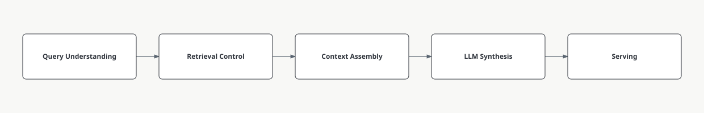

Five S3 Vectors calls per question. One filtered path, one global fallback,
three semantic variants. Metadata prefilters do the heavy lifting.

<!--
The system-architecture diagram. The design record's original 3-diagram cap
was lifted; 14 of 16 slides now carry one. Diagram built via the diagram-design skill, profile
"finsights" (blended palette, see ~/.diagram-design/profiles/finsights.md
for the derivation). Five calls verified: RETRIEVAL_IMPROVEMENT_STUDY.md
1.2 -- base filtered (topK=30), base global (topK=15), then 3 variant-
filtered calls (topK=15 each), all serial. The diagram compresses this to
5 conceptual stages (Query Understanding / Retrieval Control / Context
Assembly / LLM Synthesis / Serving) -- cross-checked against Joel's own
full architecture reference diagram mid-session and confirmed as a
faithful compression of that diagram's "LLM Serving" row specifically,
not an invented abstraction.
-->

---

# Boilerplate crowding is the dominant measured problem

44.9%exact-duplicate text rate across the corpus

The same sentence, repeated verbatim across filing years by the same company.
One sentence alone recurred 424 times.

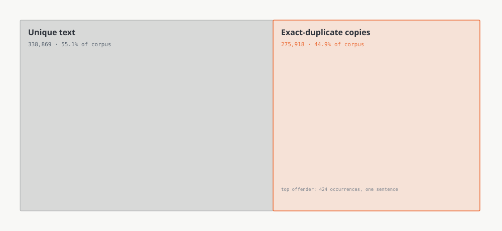

<!--
Source: RETRIEVAL_IMPROVEMENT_STUDY.md 2.1, tagged [V], measured directly
against finrag_fact_sentences.parquet (614,787 rows): 338,869 unique
texts, only 827 distinct texts appearing cross-company (2.1% of
duplicates). Root cause traced to code: sentence_expander.py:517's dedup
key is (sentence_id, cik_int, report_year, section_name) -- purely
identity-based, never compares sentence text, so the same verbatim
sentence in FY2016 and FY2017 survives twice and consumes two of 30
retrieval slots. Companion stat in the 25 real exported contexts: mean
near-duplicate rate 22.7% of context, median 100 sentences per context.
-->

---

# Similarity score distribution — the case for reranking evaluation

0.063-wide similarity band across the top 45 candidates

[0.674, 0.737]. Zero rejections at any threshold from 0.0 to 0.5. No
long tail to filter — cosine carries almost no ordering information here.

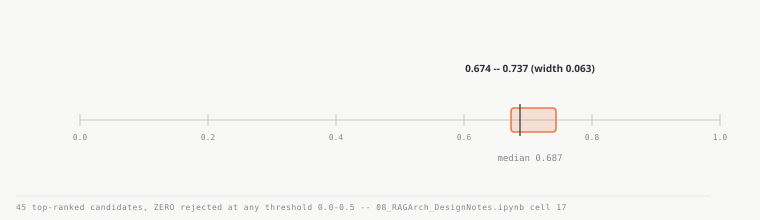

<!--
Source: RETRIEVAL_IMPROVEMENT_STUDY.md 2.4, quoting 08_RAGArch_
DesignNotes.ipynb cell 17 verbatim, tagged [V]. "All thresholds (0.0 to
0.5): 45 hits, NO rejections... no long tail of weak matches to filter
out AT ALL." This is presented in the source as the single strongest
piece of evidence for trying a cross-encoder -- only a model that reads
query and candidate jointly can extract signal a flat band this narrow
does not carry. Sets up slide 10's reranking story directly.
-->

---

# Cross-company queries — coverage and deterministic gaps

35%of exported queries entirely missing the asked year

8 of 23 real exports never contained the fiscal year the question asked
about. One 3-company export gave Netflix zero context, three times running.

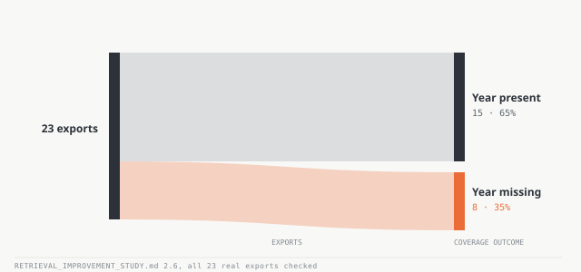

<!--
Source: RETRIEVAL_IMPROVEMENT_STUDY.md 2.6 and 2.7, both [V]. 2.6: checked
all 23 response exports against "| FY nnnn |" headers actually present;
8/23 (35%) missing the asked year entirely, years present in every context
only 2016-2020 (partly old-corpus coverage at the time, but the code-level
cause -- the global filter's year handling, bug 3.2 -- survives the
revival). 2.7: cik_int \$in filter + single global topK means ANN returns
the 30 globally-best hits regardless of company -- a company whose
sentences sit slightly further from the query gets nothing. Netflix: 0
context in 3/3 runs. Only 3 of 31 gold questions are cross_company, so
this affects 100% of the multi-company gold set that exists. "Deterministic"
is the word worth keeping -- this is a structural gap, not noisy variance.
DIAGRAM NOTE: built as a 2-column Sankey (23 exports -> present/missing),
not the type's stated "exactly 3 columns." The real data is a single
binary split with no natural middle stage; inventing one would fabricate
structure that doesn't exist. Multi-company starvation (Netflix 0/3)
deliberately kept out of the figure per the design record's own
instruction -- one number per diagram face.
-->

---
layout: default
---

# Latency breakdown — variant generation versus S3 Vectors retrieval

<v-click>

**Documented claim:** S3 Vectors retrieval is ~90% of pipeline time.

</v-click>
<v-click>

**Measured:** variant generation, 1,990ms median —
larger than the S3 query itself, 1,465ms.

</v-click>
<v-click>

The 90% figure was real. The attribution was wrong.

</v-click>

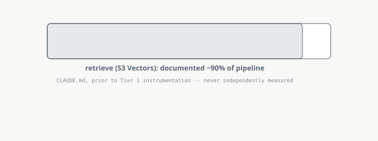

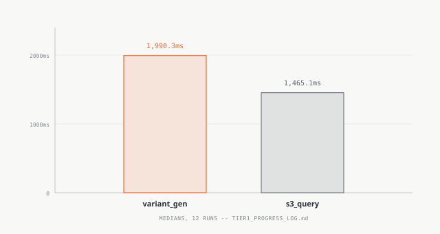

<!--
Source: TIER1_PROGRESS_LOG.md, Step 0 (2026-08-01), directly verified this
session in an earlier deck iteration. The retrieve timer wraps BOTH
variant generation (1 Haiku call + 3 embedding calls) AND the actual S3
Vectors queries as one block -- the 90% figure for the whole block was
correct, but attributing all of it to "S3 Vectors" specifically was not.
This is the finding that motivated splitting the timer into variant_gen_ms
and s3_query_ms as two separate fields, additive, not replacing the
original `retrieve` key.
-->

---
layout: default
---

# Cross-encoder reranking — cost gains against a quality regression

<v-click>

**Won on cost and context:** cross-encoder reranking at top-8 cut cost
32% and cut context 61%.
ROUGE-L was tied — 0.1120 vs
0.1012, a delta of 0.0108, inside
the noise floor of a 10-question sample.

</v-click>
<v-click>

**Rejected anyway:** answers got worse on 5 of 10 held-out questions.

Mechanism: the cross-encoder is blind to fiscal year. Off-year context rose
from 31.3% of the pool to
47.4% of what survived pruning.

</v-click>

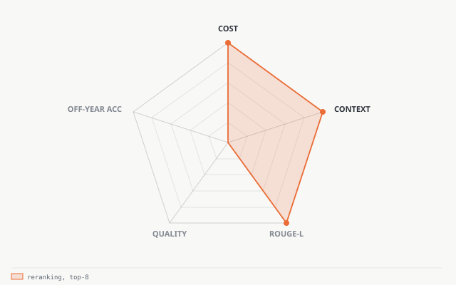

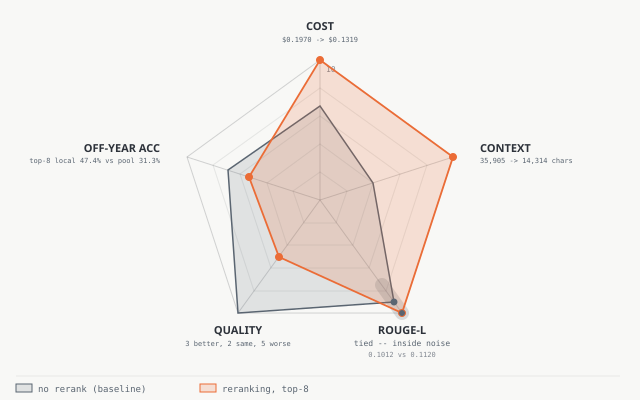

<!--
CORRECTED 2026-09-11 after a peer session's independent verification pass
caught a real error in an earlier draft: this slide previously paired
"45.2% vs 31.3%" as one comparison. Those numbers come from DIFFERENT
populations and must not be paired -- RERANKING_FINAL_SYNTHESIS.md
distinguishes 45.2% (top-8, ALL 31 questions) vs 31.5% (overall pool base)
from 47.4% (top-8, the 24 single-company/single-year "local" questions
only) vs 31.3% (local-only pool base). This slide now uses the internally
consistent local pair (47.4% vs 31.3%), independently re-verified by me
directly against RERANKING_FINAL_SYNTHESIS.md before applying the fix,
not taken on the peer's word alone.
Also corrected: the rejection was NOT primarily about wrong-year context.
Source, verbatim: "That 'top-8 is not fit to ship' follows from
5-worse-of-10." The off-year concentration is the MECHANISM/supporting
evidence for why reranking makes answers worse, not the primary reason
itself. Benefit side, also corrected upward: 61% median context reduction
and best ROUGE-L, not just the 32% cost cut this slide previously led with
alone. Mechanism detail: off-target-year blocks score higher (mean 0.300
vs 0.219) and are longer (5.49 vs 4.04 sentences) than on-year blocks --
the cross-encoder scores text quality, and report_year is never in its
input, so it structurally cannot tell a well-written wrong-year passage
from a well-written right-year one.
All figures: RERANKING_FINAL_SYNTHESIS.md, cross-referenced against
IMPLEMENTATION_GUIDE.md:420 (local-pair figures) and :425
(enable_reranking: false, confirming the rejection shipped as a real
config state, not just a recommendation).
DIAGRAM NOTE (revised 2026-09-11, orchestrator rev-6 ruling): the radar
originally rendered ROUGE-L as a clean third "win" (an accent dot at
normalized score 10 vs baseline's 9.0), but the source explicitly disclaims
it -- EMPIRICAL_METHODS_AND_FINDINGS.md:860 and the design-principles note
(line 276) both say the
underlying 0.011 delta (0.112 top-8 vs 0.101 no-rerank,
EMPIRICAL_METHODS_AND_FINDINGS.md:844,846) sits inside the noise of a
10-question sample. Asserting that delta as a visible win contradicted this
deck's own governing principle (compare every effect against the system's
own noise floor) using the deck's own numbers. Root cause: the orchestrator's
original slide-10 reframe read the docs' summary line ("the best ROUGE-L")
without the caveat two paragraphs later. Fixed: the ROUGE-L accent
vertex/dot is replaced with a muted noise-band stroke along that spoke
(covering roughly normalized score 7.5-10) carrying two neutral markers,
baseline and reranking, both pulled out of the "won" accent color; only
COST and CONTEXT keep the accent treatment on the first reveal, and the
full second-reveal chart carries the same noise band. The 5-axis
normalization otherwise stands: a disclosed linear transform (efficiency =
10 x min/observed for cost and context; ROUGE-L = 10 x value/max(value);
quality = 10 x non-worse-fraction; off-year = 10 x (1 - off-year rate)) --
every input is one of the verified figures above, no fabricated data point.
-->

---

# Streaming response delivery — stage events and token-level output

4.3mstime to first byte, against 8.96s total processing

A `queue.Queue` plus a background thread streams pipeline-stage events and
token output to the browser. Total time is unchanged. What changed is the wait.

<!--
Source: TIER1_PROGRESS_LOG.md Change 4b (2026-08-01), VERIFIED via a real
Docker rebuild + browser test this session (see vault C10 for the full
mechanism writeup: answer_query_stream(), a worker thread pushing events
into a queue, drained by a generator, re-emitted as SSE). Honest limit
carried in slide 15's notes, not repeated here per the no-open-gaps-slide
instruction: this was verified locally and in Docker, not against the
live deployed Fargate service specifically.
-->

---

# Concurrency model — thread-pool selection and shared-state audit

1genuinely shared mutable thing, found by audit

`answer_query` is blocking and I/O-heavy — that alone decided threadpool over
event loop. boto3 clients are safe to share; Sessions are not. One
lazy-table memo was the real hazard.

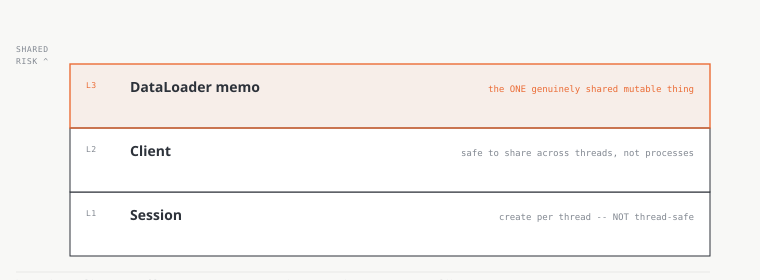

<!--
Source: the concurrency-and-shared-state design note, VERIFIED this session.
"Is boto3 thread-safe" has three answers in the source's own words:
Client generally yes (safe to share, not across processes), Resource no
(one per thread), Session no (one per thread/process) -- straight from
boto3's own docs, not recalled from memory. The one genuinely shared
mutable object found by AST audit: the DataLoader's lazy table memo.
Also: AwsSession's own client-cache factory has a latent (harmless today,
single-threaded by construction) race on first use of a new service --
documented rather than silently living with it. The design principle this
follows: "the shape of the work chooses [the concurrency model], and then
you accept the consequences" -- not a taste decision.
-->

---
class: tight-body compact-fig
---

# Fargate cost model — per-task billing and container sizing

1,220 MiBmeasured peak -> sized at 1 vCPU / 3072 MiB

Fargate charges per task, on the shape you reserve rather than what you use.
A second container in the same task is nearly free; a second task doubles the
bill. One image, two containers, ARM64 — 20% cheaper than x86_64.

<!--
Source: SYSTEMS_WALKTHROUGH.md 3.1 and 3.2, VERIFIED against the AWS
Pricing API this session (region prefix fixed, per the measurement-practice
design note, section 8.3):
\$0.032380/vCPU-hr and \$0.003560/GB-hr on ARM64, both ~20% below x86_64.
Units corrected 2026-09-11 per peer verification: source states 1,220 MiB
(10-company query) and 1,139 MiB (simple query) as the two measured
peaks, ECS_FARGATE_RUNBOOK.md:169-170; task shape is 1 vCPU / 3072 MiB,
split 2560/384 as soft reservations, :180. MiB and 3072 read as measured;
"1.22 GiB / 3 GiB" was a rounding that undersold the point of the slide.
Sizing rationale unchanged: 1,220 MiB was the worst measured peak; 2048
MiB would leave under 900 MiB headroom, so 3072 MiB (the next valid
Fargate memory tier at 1 vCPU) was chosen for ~2.5x headroom without
paying for a second vCPU. "One image, not two" (Part 2.2): a second CONTAINER
inside the same task is nearly free; a second TASK doubles the bill --
the entire reason the backend and frontend share one task rather than
being split into two services.
-->

---

# Infrastructure control plane — reproducible provisioning and teardown

$0.2938/month, everything scaled to zero

`destroy` then `up` reached the same steady state from the repository alone.
That round trip is the completeness test: if the reverse operation works, the
forward one was understood.

<!--
Source: SYSTEMS_WALKTHROUGH.md Part 7.1 (control plane as a Python
package CI calls, not reimplements) and the design-principles note's
reverse-operation-completeness-test principle, both read directly this
session. \$0.2938/month idle
floor VERIFIED this session directly against Cost Explorer, swept against
every classic silent-billing resource (NAT gateway, ALB, Elastic IP, EBS,
Route 53, Secrets Manager, KMS, Glue) -- none exist. Companion figure, NOT
independently re-measured by me this session (reported from SYSTEMS_
WALKTHROUGH.md 3.4 / the design-principles note's cost-constraint
principle, both citing the same source): the ~\$32.85
/month a NAT gateway would have cost, deliberately never adopted, in favor
of public subnets since the workload needs egress, not inbound privacy.
December's prior deployment looked healthy right up until the account
closed -- the destroy/rebuild test is what would have caught that
class of failure, not a stronger monitoring dashboard.
-->

---
layout: default
class: text-left
---

# What generalises

<v-click>Prefer unrepresentable to unlikely.</v-click>
<v-click>Trust the artifact over the description.</v-click>
<v-click>Label provenance on every number — an unlabelled one is a liability.</v-click>
<v-click>A tight cost constraint removes options you did not need.</v-click>
<v-click>Negative results, reached honestly, are still results.</v-click>

<!--
Distilled from the design-principles note (19 numbered principles in 5
groups), specifically the unrepresentable-over-unlikely, artifact-over-
description, provenance-labelling, cost-constraint, and negative-results
principles -- each already carries its own verified anchor earlier in
this deck (slide 2/15 for the cost-constraint principle, slide 10 for the
negative-results principle, this deck's whole citation discipline for the
provenance-labelling principle). The artifact-over-description reasoning previously
anchored to the asymmetry-bug slide, which is parked (see below) rather
than in the main sequence as of 2026-09-11 -- Joel's framing correction was
that the deck should read as project achievements, not process/tooling
war-stories. No "thank you" slide, per the design record. This is the close.
-->

---
layout: default
class: tight-body
---

# PARKED — not in the presentation sequence

<!--
PARKED 2026-09-11 per Joel's direct review of the live deck: "its broken
for me... the diagram also seems broken and I DONT KNOW exactly what youre
trying to show here. ignore this. discard this or push it to last page to
fix for later." This was originally slide 4, "The asymmetry bug," picked as
the orchestrator's "sharpest finding" -- itself an instance of the same
framing error this whole revision is correcting: a config bug found during
development is a process/tooling story, not a project achievement, and does
not belong in a deck about what the system does and delivers. Kept below
verbatim (content, diagrams, and citations unchanged) so nothing sourced is
lost, in case a future revision finds a real use for it. Not wired into
the main slide sequence; reachable only by paging past the close.
-->

---

# Embedding input-type asymmetry — found and fixed at zero cost
### Found by reading the live config against Cohere's own docs

<v-click>

The corpus is embedded with `input_type="search_document"`.

So is every user query.

</v-click>
<v-click>

$0to fix — zero re-embedding, zero re-upload

Cohere's dual-encoder needs the query tagged `search_query`, not `search_document`.

</v-click>
<v-click>

The correct value was already sitting in a deprecated config block. The
live path just wasn't reading it.

</v-click>

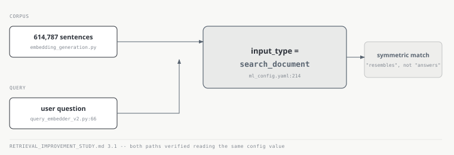

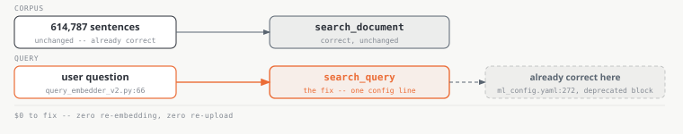

<!--
Source: RETRIEVAL_IMPROVEMENT_STUDY.md section 3.1, tagged [V] against
ml_config.yaml:214, query_embedder_v2.py:66, and Cohere's own API docs
(docs.cohere.com/docs/embeddings, docs.cohere.com/reference/embed).
VERIFIED this session by reading the cited lines directly. IMPORTANT
HONESTY NOTE: the source document explicitly does NOT claim a measured
retrieval-quality improvement from this fix -- "I am not claiming a
magnitude... it must be A/B'd." A follow-up doc (EMBEDDING_INPUT_TYPE_
ASYMMETRY.md) shows the fix was implemented (48/48 config resolutions
unchanged in an A/B against pre-edit YAML) but the retrieval-quality A/B
had not landed as of that doc's writing. Do NOT let a magnitude claim
creep onto this slide face -- the honest story is "found a real bug via
code trace + external docs, fixed at zero cost," not "improved X%."
The fourth click's reveal: ml_config.yaml:214 sets the live corpus block
to search_document, query_embedder_v2.py:66 reads that same value for the
query (the bug). But ml_config.yaml:272, inside the deprecated
rag_orchestrator block that the live path never reads, already has the
correct search_query. V1 (query_embedder.py:44) also defaulted correctly
-- V2 regressed it in a config refactor. The right answer was in the
repo the whole time, just in a block nothing was reading.
-->

